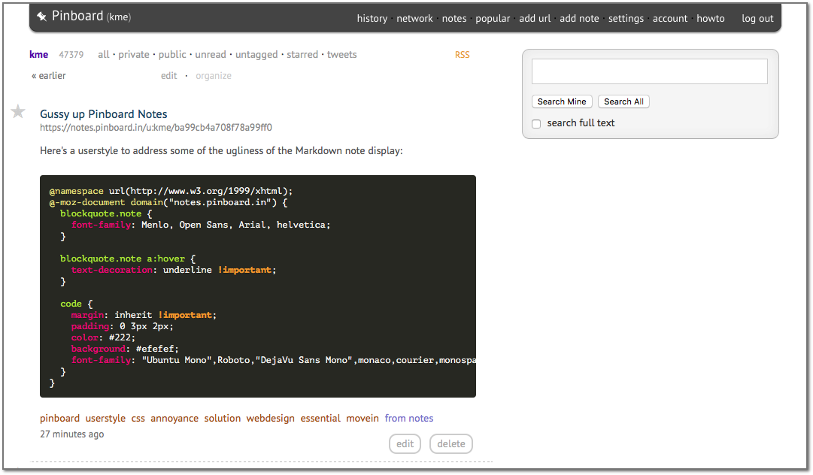

# Pinboard.in usermods


A userstyle and userscript to make Pinboard (and Pinboard Notes) slightly more
attractive, with automatic syntax highlighting for `<code>` blocks.

Works great with [Fluid][]; looks reasonably OK in Firefox (you'll need
[Stylus][] and [Tampermonkey][]).

Uses [Prism][]'s [Autoloader][] plugin to dynamically fetch any supported
language's syntax definition from a CDN. Just put the code snippet in in
a `<code>` block with a `class` attribute like this:

```
<code class="language-ruby">
5.times do
    puts "Chunky bacon!\n"
end
<code>
```
([list of supported languages][langs])

Admittedly that's a bit ungainly (I have an [AutoKey script][script] that helps
make it less painful). Perhaps I'll [add support][mdissue] for GFM-style fenced
code blocks some time later.

## Bugs

* Clicking the "edit" button and then "save" will remove the syntax
  highlighting (until you refresh the page); see #2.
  
* All `<code>` blocks will get automatically wrapped with a `<pre>`, so 
  it's not possible to have an "inline" syntax highlighted code snippet
  
## Credits

Credit for the design goes entirely to mannieschumpert's
[Pinboard.in - less stark, more appish 1.0][userstyle] userstyle. My
contributions are limited to some extra styles for Pinboard Notes and the
addition of syntax highlighting with Prism.js.

[fluid]: http://fluidapp.com
[stylus]: https://add0n.com/stylus.html
[tampermonkey]: https://tampermonkey.net/
[prism]: http://prismjs.com/
[autoloader]: http://prismjs.com/plugins/autoloader/
[langs]: http://prismjs.com/#languages-list
[script]: https://github.com/ernstki/autokey-config/blob/master/data/webdevel/Code%20from%20clipboard1.py
[mdissue]: ../../issues/6
[userstyle]: https://web.archive.org/web/20120903063906/http://userstyles.org/styles/41551/pinboard-in-less-stark-more-appish-1-0
